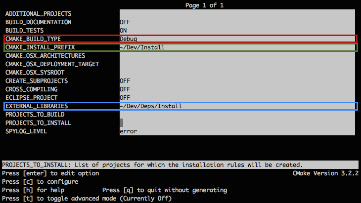

Installation for MacOSX
======================

Prerequisites for MacOSX users
--------------------------------

If not already installed:

1. Install `Mercurial <http://mercurial.selenic.com/wiki/>`_ 

2. Optionally you can install `TortoiseHg <http://tortoisehg.bitbucket.org/>`_ 

4. Install `Python 2.7 <https://www.python.org/downloads/>`_ 

5. Install `CMake <http://www.cmake.org/download/>`_ 

.. tip::
    1. You can also install `Ninja <https://github.com/martine/ninja/releases>`_ instead of using **make**.

    2. For an easy install, you can use the `Hombrew project <http://brew.sh/>`_  to install missing packages.

FW4SPL installation
-------------------------

FW4SPL works with data separation for source, build and install data. 
To prepare the development environment:

- Create a development folder (Dev)

- Create a build folder (Dev\\Build)

- Create a source folder (Dev\\Src)

- Create a install folder (Dev\\Install)

To prepare the third party environment:

- Create a third party folder (BinPkgs)

- Create a build folder (BinPkgs\\Build)

- Create a source folder (BinPkgs\\Src)

- Create a install folder (BinPkgs\\Install)

.. .. image:: Directories.png
..   :scale: 50 %

.. _build_tools:

Build tools
~~~~~~~~~~~~

FW4SPL is a CMake project. That means, for each build target there is a CMakeLists that provides build parameters.
To configure you project you can use the ``cmake`` command from the build folder with the sources as arguments:
    
.. code:: bash

    ccmake /PATH/TO/fw4spl-deps

if you want to use **Ninja** as build to tools, use the option ``-G Ninja``, as following:

.. code:: bash

    ccmake -G Ninja /PATH/TO/fw4spl-deps

It is the same process for BinPkgs and FW4SPL sources.

Dependencies
~~~~~~~~~~~~~~~~~

For the third party libraries the three following repositories have to be `cloned <http://git-scm.com/book/en/v2/Git-Basics-Getting-a-Git-Repository#Cloning-an-Existing-Repository>`_ in the (BinPkgs) source folder:

- `fw4spl-deps <https://github.com/fw4spl-org/fw4spl-deps.git>`_

- `fw4spl-ar-deps <https://github.com/fw4spl-org/fw4spl-ar-deps.git>`_

- `fw4spl-ext-deps <https://github.com/fw4spl-org/fw4spl-ext-deps.git>`_

To build dependencies see :ref:`build_tools` instructions.
Some CMake variables have to be change:

- *ADDITIONAL_PROJECTS*: set the source location of fw4spl-ar-deps and fw4spl-ext-deps

- *CMAKE_INSTALL_PREFIX*: set the install location.

Press configure (*[c]*) and generate (*[g]*) makefiles. Then, compile the FW4SPL dependencies with make or ninja in the console.

Source
~~~~~~~~~~~~~~~~~

For the FW4SPL source code the three following repositories have to be `cloned <http://git-scm.com/book/en/v2/Git-Basics-Getting-a-Git-Repository#Cloning-an-Existing-Repository>`_ in the (Dev) source folder:

- `fw4spl <https://github.com/fw4spl-org/fw4spl.git>`_

- `fw4spl-ar <https://github.com/fw4spl-org/fw4spl-ar.git>`_

- `fw4spl-ext <https://github.com/fw4spl-org/fw4spl-ext.git>`_

To build soruces see :ref:`build_tools` instructions.
Some CMake variables have to be change:

- *ADDITIONAL_PROJECTS*: set the source location of fw4spl-ar and fw4spl-ext

- *CMAKE_INSTALL_PREFIX*: set the install location.

- *EXTERNAL_LIBRARIES*: set the install path of the third part libraries.

Press configure (*[c]*) and generate (*[g]*) makefiles. Then, build dependencies with make or ninja in the console.

example:

    ``make Qt``
    
    or
    
    ``ninja Qt``

Launch an application
-------------------------

To work with an specific application or several applications the cmake argument *PROJECTS_TO_BUILD* can be set. 
After an successful compilation the application can be launched with the launcher program from FW4SPL. 
Therefore the profile.xml of the application in the build folder has to be passed as argument to the launcher call in the console. (bin/launcher Bundles/MyApplicationAndVersion/profile.xml)

.. .. image:: launchApp.png
..   :scale: 50 %

Recommended software
-------------------------

The following programs may be helpful for your developments:

- Install `Eclipse CDT <https://eclipse.org/cdt/>`_. Eclipse is a multi-OS Integrated Development Environment (IDE) for computer programming. 

Release
-------------------------

To generate the projects in release, the following instruction has to be added:

- Change CMake argument CMAKE_BUILD_TYPE to release

- Reference the EXTERNAL_LIBRARIES to the install folder of third part libraries compiled in release mode (for compiling the FW4SPL projects)