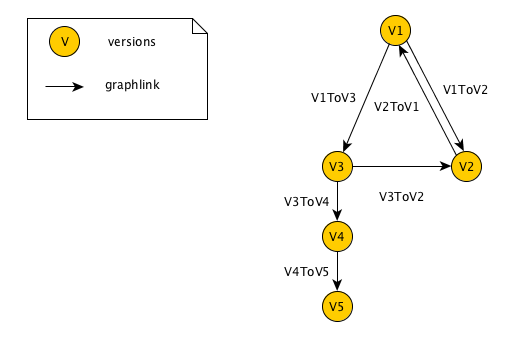
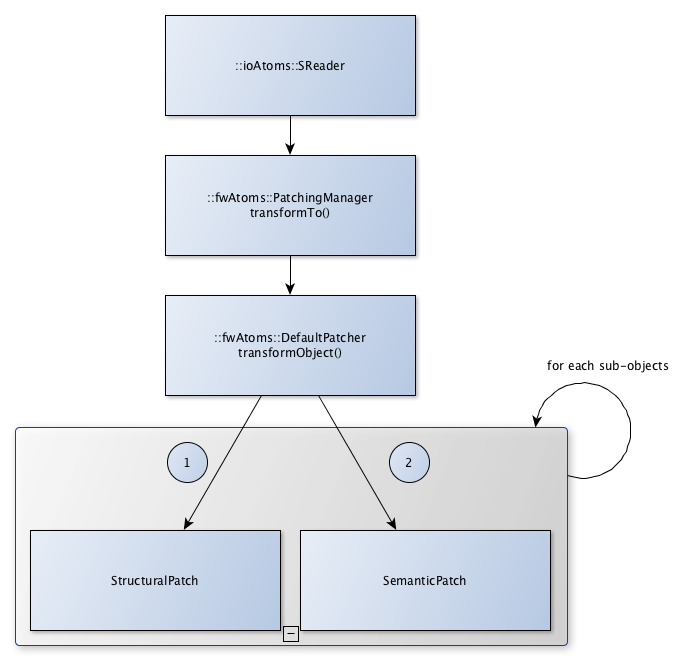

Data file migration
=======================

.. contents:: :depth: 2

Overview
-----------

The data migration system consits to convert the data to another version. It is used to read data files from older software and vice versa.

The migration is applied on the reading of files serialized using ``fwAtoms`` just before the conversion to ``::fwData::Objects`` in the ``ioAtoms::SReader``. It is also applied on the writing just after the conversion to ``fwAtoms::Base`` in the ``ioAtoms::SWriter``.

Definitions
------------

Context
    It represents a complex data: for example the `medical patient folder`_ (called **MedicalData**), the sofware preference file, ... 

Structural patch
    This patch affects only one data regardless of the context (ex: add or remove attribute, type, ...), see 
    :ref:`StructuralPatch`.

Semantic patch
    This patch is applied in a given context to migrate to a specified version without changing the data structure.
    (These patches are sometimes called contextual patches), see :ref:`SemanticPatch`.

Patcher
    Defines the methods to parse the data and applied the structural and semantic patches, see :ref:`Patcher`.

.. _medical patient folder: SDM-SAD-PatientFolder.html

.. _DataVersion:

Data Version
-------------

After the conversion from ``::fwData::Object`` to ``::fwAtoms::Object``, each data as a version number. It is defined in the camp serialisation source files (see Serialization_). Each modification of the data structure involve the increments of the data version.

.. _Serialization: SDM-SAD-Serialization.html

Example of data declaration for introspection (used to convert to ``fwAtoms``):

.. code-block:: cpp

    #include <fwCamp/UserObject.hpp>

    fwCampImplementDataMacro((fwData)(ComplexClass))
    {
        builder
            .tag("object_version", "1") // data version
            .tag("lib_name", "fwData")
            .base< ::fwData::Object>()
            .property("myString" , &::fwData::ComplexClass::m_myString)
            .property("myFloat" , &::fwData::ComplexClass::m_myFloat)
            .property("mySimpleClass" , &::fwData::ComplexClass::m_mySimpleClass)
            ;
    }

.. _ContextVersion:

Context version
----------------

The context version must be incremented after a data version changed. A context version can concern several data changed. 

The context version is described in a ``.versions`` file. It defines the version of the context and of each associated data. 

Example of ``V1.versions``:

.. code::

    {
        "context": "MedicalData",
        "version_name": "V1",
        "versions":
        {
            "::fwData::Array": "1",
            "::fwData::Boolean": "1",
            "::fwData::Image": "1",
            "::fwData::Integer": "1",
            "::fwData::Material": "1",
            "::fwData::Mesh": "1",
            "::fwData::Patient": "1",
        }
    }
    
Example of ``V2.versions``:

.. code::

    {
        "context": "MedicalData",
        "version_name": "V2",
        "versions":
        {
            "::fwData::Array": "1",
            "::fwData::Boolean": "1",
            "::fwData::Image": "2",
            "::fwData::Integer": "1",
            "::fwData::Material": "1",
            "::fwData::Mesh": "1",
            "::fwMedData::Patient": "1", 
        }
    }

.. _Migration:

Migration
----------

The migration is applied on a given context. It is described in a ``.graphlink`` file. It defines how to migrate from a context version to another. 

Example of ``V1ToV2.graphlink``:

.. code::

    {
        "context" : "MedicalData",
        "origin_version" : "V1",
        "target_version" : "V2",
        "patcher" : "DefaultPatcher",
        "links" : [
            {
                "::fwData::Patient" : "1",
                "::fwMedData::Patient" : "1"
            },
            {
                "::fwData::Image" : "1",
                "::fwData::Image" : "2"
            }
        ]
    }

The ``links`` represents the data version changes, so the associated patches could be applied.

.. warning::

    The two ``.versions`` files must have been defined (V1.versions and V2.versions).
    
.. note::
    
    The ``links`` that define the simple incrementation of a data version (without renaming) are optional. 
    The patching system can deduce the change with only the ``.versions`` files.
    

.. _Graph:
 
Graph
--------

The ``.graphlink`` and ``.versions`` files are parse and the information are stored in the ``::fwAtoms::VersionsManager``. Each context defines a graph.

Example of graph:

The graph is used to find migration path from initial version to target version.
In the example, it is possible to migrate from V1 to V5, the date is converted to V2, V4 then V5.
If several path are possible, the shortest pah is used.

.. _Structure:

Structure
-------------
    
The ``fwAtomsPatch`` library contains the base classes to perform the migration. 

PatchingManager
    This class provides the ``transformTo()`` method used to migrate the data. It uses the graph to apply 
    the patcher on each version.

patcher::IPatcher 
    Base class for patcher. 
    
patcher::DefaultPatcher
    Patcher use by default. It performs the date migration in two pass: first applies the structural patches
    recursivly on each sub-objects, then applies the semantic patches.

IPatch
    Base class for structural and semantic patches. It provides an ``apply()`` method that must be implemented in 
    sub-classes. 
    
ISemanticPatch
    Base class for semantic patches.

IStructuralPatch
    Base class for structural patches.

IStructuralCreator
    Base class for creators. It provides an ``create()`` method that must be implemented in sub-classes. 
    
SemanticPatchDB
    Singleton used to register all the semantic patches.
    
StructuralPatchDB
    Singleton used to register all the structural patches.
    
CreatorPatchDB
    Singleton used to register all the creator patches.
    
VersionsGraph
    Registers the migration graphs.
    
VersionsManager
    Singleton used to register all the version graph.

The ``fwStructuralPatch`` library contains the structural patches for ``fwData`` and ``fwMedData`` conversion.

The ``fwMDSemanticPatch`` library contains the semantic patches for ``fwData`` and ``fwMedData`` conversion in the ``MedicalData`` context.

The ``patchMedicalData`` bundle must be activated in your application to allows migration in ``MedicalData`` context. 
    
    
.. _StructuralPatch:

Structural patch
~~~~~~~~~~~~~~~~~

The structural patches are registered in the ``::fwAtomsPatch::StructuralPatchDB`` singleton. The structural patch provides a method ``apply`` that perfoms the structure conversion. The constructor defines the classname and versions of the origin and target objects as described in the ``.graphlink`` links section.

Example of structural patch to convert the ``fwData::Image`` from version 1 to 2. It adds three attributes.

.. code-block:: cpp

    #include "fwStructuralPatch/fwData/Image/V1ToV2.hpp"
    
    #include <fwAtoms/Numeric.hpp>
    #include <fwAtoms/Numeric.hxx>
    
    namespace fwStructuralPatch
    {
    
    namespace fwData
    {
    
    namespace Image
    {
    
    V1ToV2::V1ToV2() : ::fwAtomsPatch::IStructuralPatch()
    {
        m_originClassname = "::fwData::Image";
        m_targetClassname = "::fwData::Image";
        m_originVersion   = "1";
        m_targetVersion   = "2";
    
    }
    
    // ----------------------------------------------------------------------------
    
    void V1ToV2::apply(
        const ::fwAtoms::Object::sptr& previous, // object in the origin version
        const ::fwAtoms::Object::sptr& current, // clone of the previous object to convert in the targer version
        ::fwAtomsPatch::IPatch::NewVersionsType& newVersions) // map < previous object, new object > association
    {
        // Check if the previous and current object version and classname correspond
        IStructuralPatch::apply(previous, current, newVersions);
    
        // Update object version
        this->updateVersion(current);
    
        // Create helper
        ::fwAtomsPatch::helper::Object helper(current);
    
        helper.addAttribute("nb_components", ::fwAtoms::Numeric::New(1));
        helper.addAttribute("window_center", ::fwAtoms::Numeric::New(50));
        helper.addAttribute("window_width", ::fwAtoms::Numeric::New(500));
    }
    
    } // namespace Image
    
    } // namespace fwData
    
    } // namespace fwStructuralPatch

.. _Creator:

Creator
~~~~~~~~

The creator provides a method ``create`` that allows to create a new object with the default attribute initialization. The creator are used in structural patches to create new sub-objects. 
The creator are registered in the ``::fwAtomsPatch::StructuralCreatorDB`` singleton.

This is used if we need to add an attribute that is a non-null object.

Example of creator for the ``::fwMedData::Patient`` :

.. code-block:: cpp

    
    #include "fwStructuralPatch/creator/fwMedData/Patient1.hpp"
    
    #include <fwAtoms/String.hpp>
    
    #include <fwAtomsPatch/helper/Object.hpp>
    
    namespace fwStructuralPatch
    {
    namespace creator
    {
    namespace fwMedData
    {
    
    Patient1::Patient1()
    {
        m_classname = "::fwMedData::Patient";
        m_version   = "1";
    }
    
    // ----------------------------------------------------------------------------
    
    ::fwAtoms::Object::sptr Patient1::create()
    {
        // Create an empty ::fwAtoms::Object with the classname, version and ID informtation
        ::fwAtoms::Object::sptr patient = this->createObjBase(); 
        
        ::fwAtomsPatch::helper::Object helper(patient);
    
        helper.addAttribute("name", ::fwAtoms::String::New(""));
        helper.addAttribute("patient_id", ::fwAtoms::String::New(""));
        helper.addAttribute("birth_date", ::fwAtoms::String::New(""));
        helper.addAttribute("sex", ::fwAtoms::String::New(""));
    
        return patient;
    }
    
    } // namespace fwMedData
    } // namespace creator
    } // namespace fwStructuralPatch

.. _SemanticPatch:

Semantic patch
~~~~~~~~~~~~~~

The semantic are registered in the ``::fwAtomsPatch::SemanticPatchDB`` singleton.
The structural patch provides a method ``apply`` that perfoms the structure conversion. The constructor 
defines the origin classname and versions of the objects and the origin and taget context version as 
described in the ``.graphlink``.

The semantic patch is used if we need several object to perform the object migration.

Example of semantic patch :

.. code-block:: cpp

    #include "fwMDSemanticPatch/V2/V3/fwData/Image.hpp"

    #include <fwAtoms/Object.hpp>
    #include <fwAtoms/Object.hxx>
    #include <fwAtoms/Numeric.hpp>
    #include <fwAtoms/Numeric.hxx>

    #include <fwAtomsPatch/helper/functions.hpp>

    namespace fwMDSemanticPatch
    {
    namespace V2
    {
    namespace V3
    {
    namespace fwData
    {

    Image::Image() : ::fwAtomsPatch::ISemanticPatch()
    {
        m_originClassname = "::fwData::Image";
        m_originVersion   = "1";
        this->addContext("MedicalData", "V2", "V3"); // Context version
    }

    // ----------------------------------------------------------------------------

    void Image::apply(
        const ::fwAtoms::Object::sptr& previous, // object in the origin version
        const ::fwAtoms::Object::sptr& current, // clone of the previous object to convert in the targer version
        ::fwAtomsPatch::IPatch::NewVersionsType& newVersions) // map < previous object, new object > association
    {
        // Check if the previous and current object version and classname correspond
        ISemanticPatch::apply(previous, current, newVersions);
        
        // Cleans object fields (also creates them if they are missing)
        ::fwAtomsPatch::helper::cleanFields( current );
        
        ::fwAtomsPatch::helper::Object helper( current );

        ::fwAtoms::Object::sptr array        = ::fwAtoms::Object::dynamicCast(previous->getAttribute("array"));
        ::fwAtoms::Numeric::sptr nbComponent =
                 ::fwAtoms::Numeric::dynamicCast(array->getAttribute("nb_of_components"));

        helper.replaceAttribute("nb_components", nbComponent->clone());
    }

    // ----------------------------------------------------------------------------

    } // namespace fwData
    } // namespace V3
    } // namespace V2
    } // namespace fwMDSemanticPatch

This patch changed the attribute ``nb_components`` in the image copied from array ``nb_of_components``.
   
   
.. _Patcher:
 
Patcher
~~~~~~~~

The patcher defines the methods to parse the data and applied the structural and semantic patches. It must inherit from ``fwAtomsPatch::patcher::IPatcher`` and implements the ``transformObject()`` method. 

We usually used the ``DefaultPatcher``. The conversion is processed in two pass: first it applies the structural patches recursivly on each sub-objects, then it applies the sementic patches recursivly on each sub-objects.

Rules
~~~~~~

A changes in data (fwData, fwMedData, ...) involve the incrementation of the data version and the context version
and the creation of structural and/or semantic patch.

A creator patch of a data must create a ``fwAtoms::Object`` equal as if we create the data (with a ``New()``) 
and convert it to ``fwAtoms``.

The *buffer object* (converted as BLOB in fwAtoms) is just reused (without copy) during the migration. If its 
structure is modified, you should clone the buffer before to applies the patch. 

Usage
--------

If you have to modify data, you don't have to reimplemetent all the migration system, but there is step to perform :

step 1
    Increment the data version in camp declaration (and update the declaration of the attribute if needed). See
    :ref:`DataVersion`.
    
step 2
    Increment the context version: create a new ``.versions`` files (with the associated data version). See
    :ref:`ContextVersion`.
    
step 3
    Create the ``.graphlink`` file. See :ref:`graphlink<Migration>`.
    
step 4 (optional)
    Create the creator if you need to add a new non-null objet. See :ref:`Creator`.
    
step 5
    Create the structural patch. See :ref:`StructuralPatch`.
    
step 6 (optional)
    Create the semantic patch if you need other objects to update the current object. See :ref:`SemanticPatch`.
    
    
.. note::

    You can create migration patches from V1 to V3 without using the V1 to V2 and V2 to V3. 

 