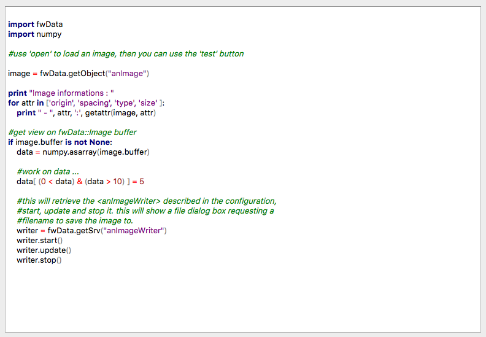
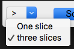
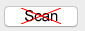
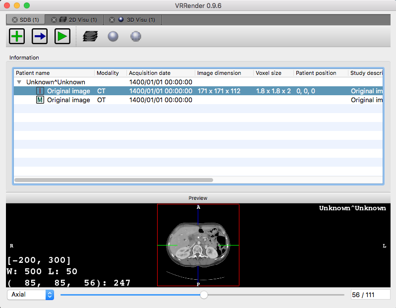

guiQt
=======

::guiQt::editor::Code
----------------------

This service displays a code editor and works on a ::fwData::String. This editor provide highlighting for python and
C++.

    
**Configuration:**

.. code-block:: xml

    <object type="::fwData::String">
        <service uid="codeEditor" type="::gui::editor::IEditor" impl="::guiQt::editor::Code" autoConnect="yes">
            <config>
                <language name="Python" />
            </config>
        </service>
    </object>
    
- Language name can be "Python" or "Cpp". 
- The text is stored in the ``::fwData::String``.

::guiQt::editor::SSelectionMenuButton
--------------------------------------

This service show a menu button. The user can select one item in the menu and the service sends a message
containing the value of the item. This menu is configurable in xml.

**Configuration:**

.. code-block:: xml

    <service uid="selectionMenuButton" impl="::uiImage::SSelectionMenuButton">
        <text>...</text>
        <toolTip>...</toolTip>
        <items>
            <item text="One" value="1" />
            <item text="Two" value="2" />
            <item text="Six" value="6" />
        </items>
        <selected>2</selected>
    </service>
    
text (optional, default ">")
    Text displayed on the button
    
toolTip (optional)
    Button tool tip
    
items
    List of the menu items

item
    One item
    
    text
        The text displayed in the menu
    value
        The value emitted when the item is selected
        
selected
    The value of the item selected by default 

When the user select an item, the signal ``selected(int selection)`` is emitted: it sends the value of the selected 
item.

.. note::
    This service doesn't modify its associated object, so it can work on any type of object.

::guiQt::editor::SSignalButton
-------------------------------

This editor shows a button and send a signal when it is clicked.

**Configuration:**

.. code-block:: xml

    <service uid="..." impl="::guiQt::editor::SSignalButton" >
        <config>
            <checkable>true|false</checkable>
            <text>...</text>
            <icon>...</icon>
            <text2>...</text2>
            <icon2>...</icon2>
            <checked>true|false</checked>
            <iconWidth>...</iconWidth>
            <iconHeight>...</iconHeight>
        </config>
       </service>

text (optional):
     text displayed on the button
 
icon (optional): 
    icon displayed on the button

checkable (optional, default: false): 
    if true, the button is checkable

text2 (optional): 
    text displayed if the button is checked

icon2 (optional): 
    icon displayed if the button is checked

checked (optional, default: false): 
    if true, the button is checked at start
    
iconWidth (optional): 
    icon width

iconHeight (optional): 
    icon height

.. note::
    This service doesn't modify its associated object, so it can work on any type of object.

::guiQt::editor::DynamicView
-----------------------------

This editor manages tabs containing sub-configurations. It receives signals with ::fwActivities::registry::ActivityMsg
containing the view information (config Id, parameters, ...).

It is usually used with the ::activities::action::SActivityLauncher action. This action sends the signals containing the 
view information.

    
In our applications, we mostly use the Series selector as main configuration. The main configuration is launched in the 
first tab and is not closable. 

**Configuration:**

.. code-block:: xml

    <service type="::gui::view::IView" impl="::guiQt::editor::DynamicView" autoConnect="yes" >
       <config dynamicConfigStartStop="false">
           <appConfig id="Visu2DID" title="Visu2D" >
               <parameters>
                   <parameter replace="SERIESDB" by="medicalData"  />
                   <parameter replace="IMAGE" by="@values.image"  />
               </parameters>
           </appConfig>
       </config>
   </service>
           
The tag **appConfig** defines the information needed to launch the main sub-configuration. 

id: 
    configuration identifier

title: 
    title of the created tab
    
parameters: 
    list of the parameters needed to launch the configuration. 
    
    replace: 
        name of the parameter as defined in the AppConfig
    by: 
        defines the string that will replace the parameter name. It should be a simple string (ex. frontal) or define a 
        sesh@ path (ex. @values.myImage). The root object of the sesh@ path is this service object.
    
